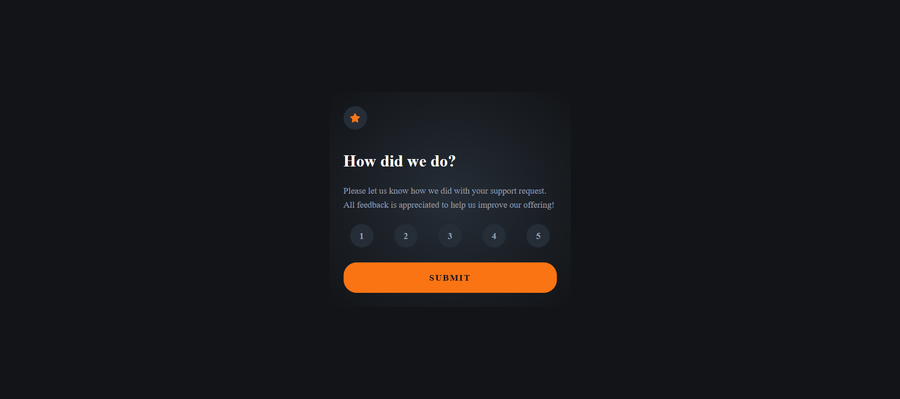

# Frontend Mentor - Interactive Rating component solution

This is a solution to the [Interactive Rating component challenge on Frontend Mentor](https://www.frontendmentor.io/challenges/interactive-rating-component-koxpeBUmI). Frontend Mentor challenges help you improve your coding skills by building realistic projects.

## Table of contents

- [Overview](#overview)
  - [The challenge](#the-challenge)
  - [Screenshot](#screenshot)
  - [Links](#links)
- [My process](#my-process)
  - [Built with](#built-with)
  - [Useful resources](#useful-resources)
- [Author](#author)

## Overview

### The challenge

Users should be able to:

- Select and submit a number rating
- See the "Thank you" card state after submitting a rating
- See hover and focus states for all interactive elements on the page

### Screenshot

### Links

- Solution URL: [Add solution URL here](https://github.com/YuliaLantzberg/interactive-rating-component_fm)
- Live Site URL: [Add live site URL here](https://yulialantzberg.github.io/interactive-rating-component_fm/)

## My process

1. Analyze the designs
2. Write the html markup (utilizing the BEM methodology)
3. Implement my CSS reset code
4. Add all the root/global values and mixins I might need
5. Add the styling for mobile view
6. Check responsiveness, review and fix and refactor code if needed
7. Implement the JS functionality, section by section.
8. Review code and do refactoring and fixes if needed.
9. Prepare the readme file

### Built with

- Semantic HTML5 markup
- CSS custom properties
- Flexbox
- CSS Grid
- Mobile-first workflow
- [Less ](https://lesscss.org/) - Css extension
- Responsive design
- Javascript

### Useful resources

- [Px to Rem](https://nekocalc.com/px-to-rem-converter) - Converter frpm px to rem and vice versa
- [Google Fonts](https://fonts.google.com/)
- [Css Reset](https://www.joshwcomeau.com/css/custom-css-reset/#one-box-sizing-model-2)

## Author

- Frontend Mentor - [@YuliaLantzberg](https://www.frontendmentor.io/profile/YuliaLantzberg)
- Linkedin - [@YuliaLantzberg](https://www.linkedin.com/in/yulia-lantzberg/)
